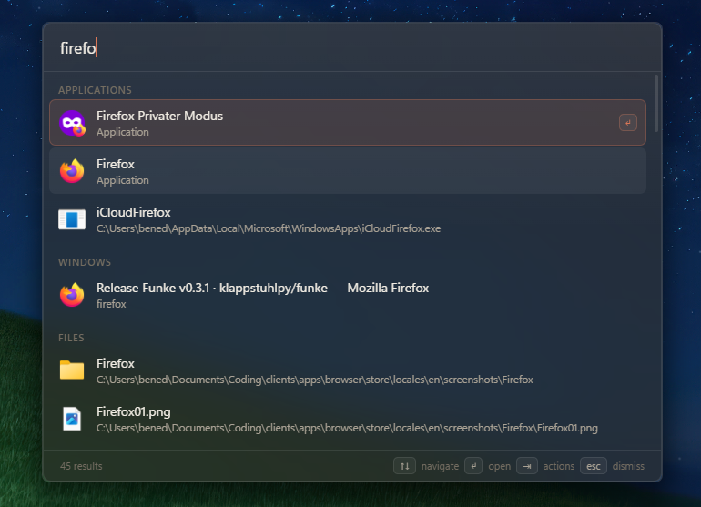
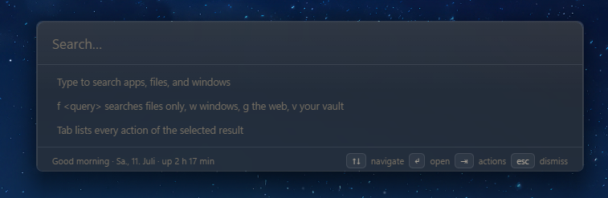
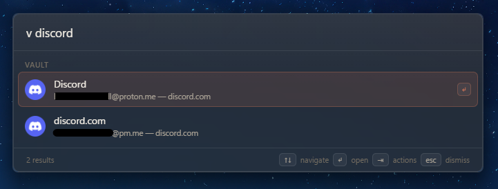
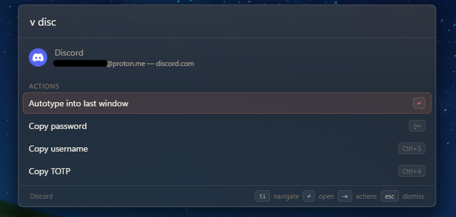
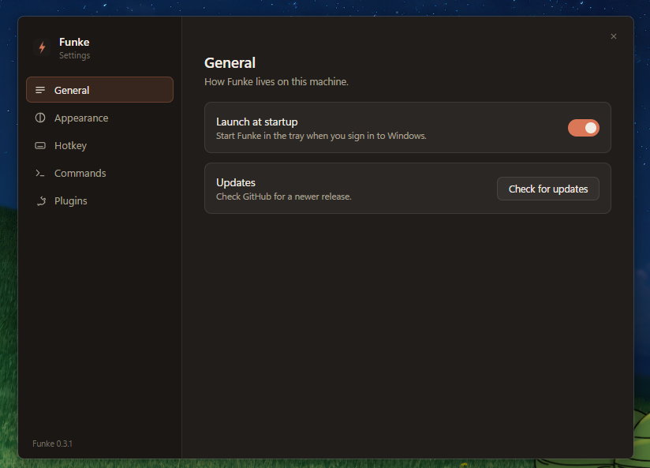
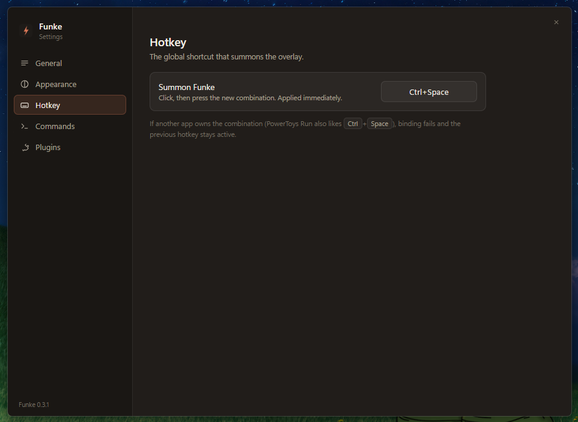
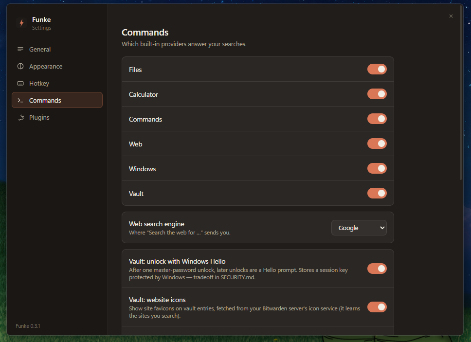
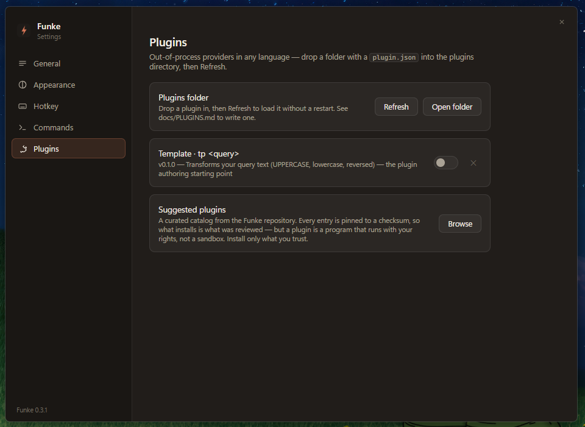

<div align="center">
  

  # Funke

  **A fast, extensible Spotlight-style launcher for Windows.**

  Summon a search bar with a global hotkey, then launch apps, find files, switch windows,
  run actions, and search your Bitwarden / Vaultwarden vault with autotype — all from the keyboard.

  <br>

  [](https://github.com/klappstuhlpy/funke/actions/workflows/ci.yml)
  
  
  
  
  
  [](LICENSE)

  <br>

  

</div>

## Features

`Ctrl+Space` toggles a native-glass overlay (acrylic backdrop, DWM shadow, Win11 rounded
corners, sized to its content) in a warm Anthropic-inspired theme. Type to search — results
arrive in labeled sections, frequently picked ones bubble up (frecency).

- **Applications** — fuzzy-search installed apps (Start Menu, Store/UWP, PATH) with real icons.
- **Files** (`f`) — background filename index of your chosen folders, watcher-refreshed.
- **Windows** (`w`) — switch to any open window (Enter focuses, restores minimized) or end its process.
- **Vault** (`v`) — Bitwarden/Vaultwarden via the official `bw` CLI: unlock in the overlay
  (or via **Windows Hello** after the first unlock, opt-in), autotype into the previous
  window, copy password/username/**TOTP** with 30 s clipboard auto-clear, website icons,
  idle auto-lock. Prefix-only for privacy — see [SECURITY.md](SECURITY.md).
- **Credentials for the app you're in** — summon Funke over Discord (or a GitHub tab) and the
  empty overlay offers *that* credential, matched by process, window title, and the browser's
  address bar; Enter types it straight back into the window you came from. Locked vault? It
  offers the unlock first. Autotype follows a per-entry sequence when you give the item an
  `autotype` field (`{USERNAME}{TAB}{PASSWORD}{TOTP}{ENTER}`, `{DELAY=500}`, …).
- **Web search** (`g`) — configurable engine, wearing your default browser's icon.
- **Calculator** — `2+2*3` inline; Enter copies the result.
- **System commands** — lock, sleep, shut down, restart, empty recycle bin; destructive ones ask to confirm.
- **Plugins** — separate executables in any language speaking JSON-RPC over stdio. Install
  from the **catalog** in Settings → Plugins (every entry is pinned to a checksum), or drop a
  folder into `%APPDATA%\funke\plugins`. Write your own with
  [docs/PLUGINS.md](docs/PLUGINS.md), starting from `funke-plugins/template`.
- **Actions menu** — Enter runs the default action, **Tab lists every action** of a result
  (open / reveal in Explorer / copy path, …), each with its own shortcut (⇧↵, Ctrl+3, …)
  that also works straight from the result list.
- **Overview** — the empty overlay shows the credential for the app you came from, recent
  picks (removable with a click), a greeting/date/uptime line, and first-run tips.
- **Settings window** (tray → Settings, or search "settings") — summon hotkey, accent color,
  overlay width, web engine, provider toggles, file-index folders, plugins, launch-at-startup —
  all applied live.

**Status:** M0–M5 complete — the full roadmap lives in [docs/PLAN.md](docs/PLAN.md).

## Screenshots

<table>
  <tr>
    <td width="33%" align="center">
      
      <sub><b>Overview</b><br>The empty overlay — tips, greeting, uptime</sub>
    </td>
    <td width="33%" align="center">
      
      <sub><b>Vault</b> (<code>v</code>)<br>Prefix-only search over Bitwarden/Vaultwarden</sub>
    </td>
    <td width="33%" align="center">
      
      <sub><b>Actions</b> (<kbd>Tab</kbd>)<br>Autotype, copy password / username / TOTP</sub>
    </td>
  </tr>
</table>

<details>
<summary><b>Settings</b> — hotkey, providers, plugins, startup (click to expand)</summary>
<br>
<table>
  <tr>
    <td width="50%" align="center">
      
      <sub><b>General</b> — launch at startup, updates</sub>
    </td>
    <td width="50%" align="center">
      
      <sub><b>Hotkey</b> — rebind the summon shortcut</sub>
    </td>
  </tr>
  <tr>
    <td width="50%" align="center">
      
      <sub><b>Commands</b> — provider toggles, web engine, vault options</sub>
    </td>
    <td width="50%" align="center">
      
      <sub><b>Plugins</b> — installed plugins and the curated catalog</sub>
    </td>
  </tr>
</table>
</details>

## Install

Grab the installer (`funke-<version>-windows-x86_64-setup.exe`) or the portable zip from
[Releases](https://github.com/klappstuhlpy/funke/releases). The installer is per-user (no
UAC prompt) and can enable "start when I sign in" for you; Funke updates itself from there
(Settings → General → Check for updates).

Builds are not code-signed yet, so SmartScreen will warn on first run — "More info" →
"Run anyway", or use the portable zip.

## Development

Requires Rust ≥ 1.85 and Windows 10/11 (WebView2 is preinstalled on Windows 11).

```bash
cargo run -p funke-app        # build & run (first build takes a few minutes)
cargo test --workspace        # unit tests
cargo fmt --all && cargo clippy --workspace --all-targets -- -D warnings
```

Note: the UI in `crates/funke-app/ui/` is embedded at compile time (no Node toolchain,
no dev server) — rebuild after editing it.

Contributions: read [CONTRIBUTING.md](CONTRIBUTING.md) first — or write a
[plugin](docs/PLUGINS.md), which lives in its own repository under any license you like.

## Layout

```text
crates/
├── funke-core/      # UI-free core: SearchProvider trait, Registry (+ prefix scoping), fuzzy, frecency
├── funke-shell/     # Windows shell helpers shared by providers (COM icon extraction)
├── funke-apps/      # installed-apps provider: Get-StartApps (AUMIDs) + PATH executables
├── funke-files/     # filename index of chosen roots: walkdir + notify refresh, `f` prefix
├── funke-utils/     # utility providers: calculator, web search (`g`, engine from settings), system commands
├── funke-windows/   # window switcher (`w`): switch to or kill open top-level windows
├── funke-vault/     # Bitwarden/Vaultwarden (`v`): bw serve client, autotype, prefix-only privacy
├── funke-plugin/    # plugin protocol (JSON-RPC/stdio): author SDK + launcher-side host
└── funke-app/       # Tauri shell: tray, hotkey, overlay + settings windows, IPC commands, built-in providers
    └── ui/          # static frontend (HTML/CSS/JS, embedded via frontendDist)
funke-plugins/       # first-party out-of-process plugins (template/ is the authoring starting point)
docs/PLAN.md         # full project plan: architecture, indexing, Bitwarden, roadmap
docs/PLUGINS.md      # how to write a plugin (manifest, protocol, distribution)
```

## License

[MIT](LICENSE).
